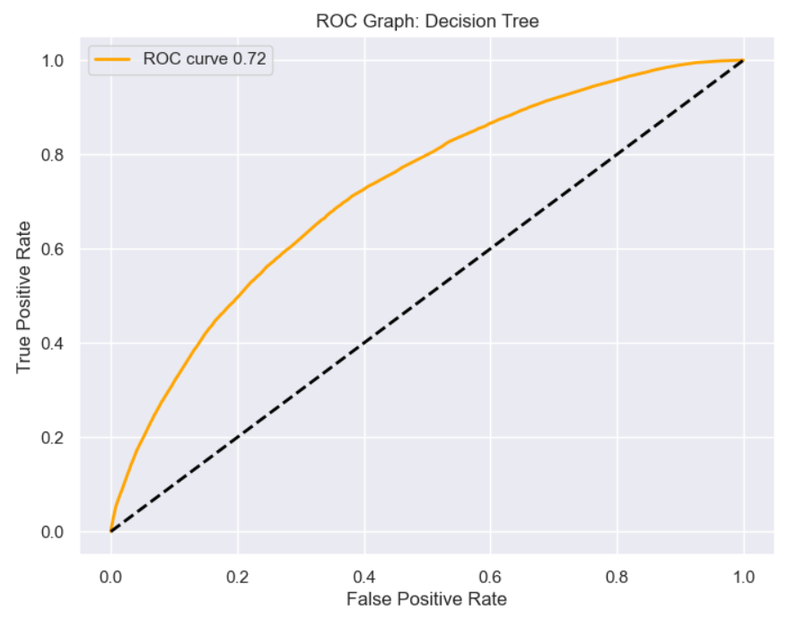
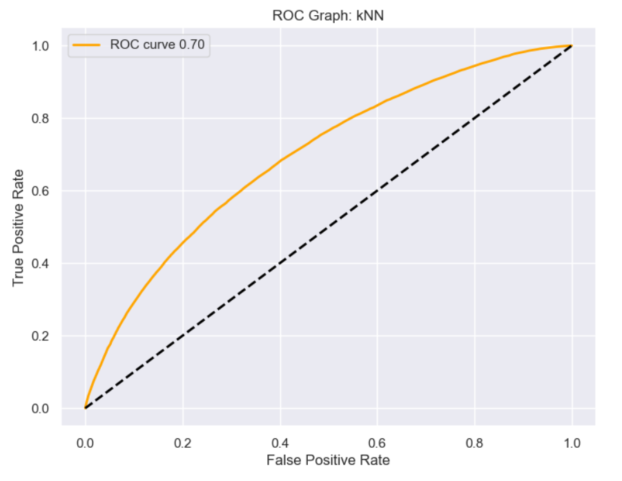

# Authors
* Jake Kroeker
* Jeremiah McGrath
* Christopher McMichael

# Table of Contents
- [Authors](#authors)
- [Table of Contents](#table-of-contents)
- [Introduction](#introduction)
- [Selection of Data](#selection-of-data)
  - [Original Data Fields](#original-data-fields)
  - [Data Munging](#data-munging)
    - [Dropped Data Fields](#dropped-data-fields)
    - [Altered Data Fields](#altered-data-fields)
  - [Feature Engineering](#feature-engineering)
    - [Added Data Fields](#added-data-fields)
    - [Altered Fields for ML](#altered-fields-for-ml)
- [Methods](#methods)
  - [Tools and Algorithms Used](#tools-and-algorithms-used)
    - [Tools](#tools)
    - [Classification Algorithms](#classification-algorithms)
  - [Selecting our Parameters](#selecting-our-parameters)
  - [Decision Tree Optimal Parameters Loop Ranges](#decision-tree-optimal-parameters-loop-ranges)
- [Results](#results)
  - [Accuracy of Decision Tree](#accuracy-of-decision-tree)
  - [ROC Graph: Decision Tree](#roc-graph-decision-tree)
  - [Accuracy of KNeighborsClassication](#accuracy-of-kneighborsclassication)
  - [ROC Graph: kNN](#roc-graph-knn)
  - [Study Findings](#study-findings)
- [Discussion](#discussion)
- [Summary](#summary)
- [References](#references)
- [Presentation](#presentation)

# Introduction

Kickstarter is an online crowdfunding website designed to allow small project startups to get adequate funding to bring their product to market through "backers" making contributions that could be linked to rewards offered by the hosting group. At the beginning of a campaign, groups select their launch date, how much they aim to raise, their deadline, and what category their product or idea fits with the best. These are some of the features we will be investigating.

Our goal with this exploration is to predict whether or not a prospective Kickstarter campaign will be successful or not based on a few key features -- specifically campaign duration, campaign goal, and category.

# Selection of Data

The chosen dataset for this report is called Kickstarter Projects at (https://www.kaggle.com/datasets/kemical/kickstarter-projects). This file was downloaded from Kaggle's website, in the download ZIP there are two files -- a 2016 file and a 2018 file, we're choosing to use the 2018 file to get as much usable data as possible. The dataset includes information about Kickstarter campaigns that have been launched between 2009-2018.

## Original Data Fields
1. ``ID`` - The internal ID of the Kickstarter project.
2. ``name`` - The project's name.
3. ``category`` - The project's specific category.
4. ``main_category`` - The project's overarching category.
5. ``currency`` - The currency used to support the project.
6. ``deadline`` - The project's deadline date.
7. ``goal`` - The project's fundraising goal in USD.
8. ``launched`` - The project's launch date.
9. ``pledged`` - The amount pledged in USD.
10. ``state`` - The project's state; options include "success", "failed", "cancelled".
11. ``backers`` - The number of backers.
12. ``country`` - The country the project was launched in.
13. ``usd pledged`` - The amount pledged in USD, converted by Kickstarter.
14. ``usd_pledged_real`` - The amount pledged in USD, converted using an external API.
15. ``usd_goal_real`` - The goal in USD, converted using an external API.

## Data Munging

### Dropped Data Fields
1. ``ID`` - Dropped due to being an internal Kickstarter value, irrelevant to our project.
2. ``name`` - Dropped due to not being useful for our classification models.
3. ``currency`` - Dropped due to not being useful for our classification models.
4. ``goal`` - Dropped due to having large amounts of bad data.
5. ``pledged`` - Dropped due to not aligning with our goal of being able to predict a campaign's success based off its initial characteristics.
6. ``backers`` - Dropped due to not aligning with our goal of being able to predict a campaign's success based off its initial characteristics.
7. ``usd pledged`` - Dropped due to not aligning with our goal of being able to predict a campaign's success based off its initial characteristics.
8. ``usd_pledged_real`` - Dropped due to not aligning with our goal of being able to predict a campaign's success based off its initial characteristics.

### Altered Data Fields
1. ``deadline`` - Converted to date-time values to aid in the calculation of time deltas.
2. ``launched``
    - Contained some invalid dates, notably those defined as the start of Unix time. Rows with years before 2000 were dropped due to being blatantly bad data samples – (Kickstarter was founded in 2009).
    - Converted to date-time values to aid in the calculation of time deltas.
6. ``country`` - Contained some unusual values, specifically ``'N,0"`` - (see: "Null Island"). Due to its infrequent occurrence, we chose to simply drop rows with this value from our dataset – about 3000 in total.
7. ``state``
    - Removed rows with states matching ``undefined``, ``live``, or ``suspended``, as these values represent campaigns that do not align with our analysis.
    - Transformed data points with the value ``canceled`` into ``failed``, as these states represent the same result for our analysis.

## Feature Engineering

### Added Data Fields
1. ``launchedUX`` - The time of the project's launch measured in days since Unix start - (January 1, 1970 at 00:00:00).
2. ``deadlineUX`` - The time of the project's deadline measured in days since Unix start - (January 1, 1970 at 00:00:00).
3. ``duration`` - The duration in days that the project was active.
4. ``stateInt`` - ``0`` for a failed or canceled ``state``,  ``1`` for a successful ``state``.

### Altered Fields for ML
The following fields were transformed into dummy variables via the Pandas function ``get_dummies()`` to prepare them for use in our ``scikit-learn`` models:
1. ``category``
2. ``main_category``
3. ``country``

# Methods

Considering our goal is to classify Kickstarter projects as "success" or "failed" using our machine learning analysis, we chose to utilize primarily Decision Trees while also testing with KNeighbor Classfication strategies. 

## Tools and Algorithms Used

### Tools

* Pandas
* Numpy
* Scikit-learn
* Graphviz
* Seaborn
* Matplot library

### Classification Algorithms

* Decision Tree
* KNeighbors

## Selecting our Parameters
* Decision Tree: In order to select the best argument values for our Decision Tree algorithm, we chose to run a looped training routine that utilized the ``cross_val_score`` function. For each run we altered which argument we were testing while applying the previously determined best values for any remaining arguments. This was then repeated for each argument in order to get an optimal output. This form of serially testing argument values was chosen instead of running every combination of argument values together in a single loop in order to save on computation time.
* KNeighbor Classification: The primary arguments we could change with this classification algorithm were the selection of features, and the neighbor value. For the neighbor value we settled on the square root of the dataset's sample size, which is a known general rule of thumb2. For determining the classification algorithm's feature set we utilized the same combination testing algorithm that was used with determining the Decision Trees feature set.

## Decision Tree Optimal Parameters Loop Ranges
* features - All combinations of ``[category, main_category, country, usd_goal_real, duration, launchedUX, deadlineUX]``
* ``max_depth`` - Range from ``1`` to ``20`` with increments of ``1``.
* ``min_samples_split`` - Range from ``2`` to ``150`` with increments of ``5`` - loop was repeated with a smaller subset of values after other arguments were selected.
* ``min_samples_leaf`` - Range from ``1`` to ``100`` with increments of ``5`` - loop was repeated with a smaller subset of values after other arguments were selected.
* ``min_impurity_decrease`` - Range from ``0.0`` to ``0.5`` with increments of ``0.1``.

# Results

## Accuracy of Decision Tree

For our Decision Tree, the accuracy of training data was roughly 70.41%, while the accuracy of testing data was roughly 69.48%.

|  | Actual |  |
| -------- | -------- | -------- |
| <strong>Predict</strong> | Failed | Success |
| Failed  | 59195 | 11676 |
| Success | 22223 | 17971 |

## ROC Graph: Decision Tree

## Accuracy of KNeighborsClassication

The KNeighborsClassification model had a similar result, with the accuracy of training data at roughly 68.11%, and the accuracy of testing data at roughly 68.08%.

|  | Actual |  |
| -------- | -------- | -------- |
| <strong>Predict</strong> | Failed | Success |
| Failed  | 61568 | 9303 |
| Success | 26152 | 14042 |

## ROC Graph: kNN

## Study Findings

While our models can provide some predictive power, there is still room for improvement. We found that, while all numeric features have an impact on the chance of a project's success, the features of campaign duration, campaign goal, and category have the highest impact on the overall likelihood that a project will succeed.

# Discussion

In utilizing these findings, hopeful campaign managers may want to be mindful of how they choose to categorize their campaign, as particular categories may find greater success. Additionally, the monetary goal and deadline for the campaign hold a great deal of importance, specifically that both are set realistically according to the scope of the project.

For future research, we would be interested in investigating whether campaign managers with previously successful projects have an improved success rate when launching new campaigns; and, further, if they demonstrate greater success in reaching their monetary goals, and providing their backers with deliverables in the agreed upon timeframe.

Additionally, we conducted surveys of various related projects on platforms such as Kaggle and Medium, aiming to compare our model's performance to similar efforts. Popular technologies utilized by these studies included KNeighbors, Decision Trees, as well as Random Forest, XGBoost, and Naive Bayes. Notably, our final models approach 70% accuracy in predicting whether a Kickstarter campaign would succeed – while the studies we surveyed reported accuracies upwards of 80%1. This gap between our results and the results of our contemporaries further suggests that our models, while demonstrating some predictive ability, could undergo additional tuning to achieve better results.

# Summary

In this study, we aimed to predict the success or failure of Kickstarter campaigns based on key features such as campaign duration, campaign goal, and category. We utilized machine learning algorithms, primarily Decision Trees and KNeighborsClassification, on a dataset spanning Kickstarter projects from 2009 to 2018. Here are the key findings:

1. Data Preparation: We performed data munging by dropping irrelevant fields, handling invalid data, and engineering new features such as time since Unix start and duration of the campaign.

2. Modeling Approach: Decision Trees were our primary focus, with parameters optimized through looped training routines and cross-validation. We also tested KNeighborsClassification as an alternative.

3. Results:

   * The Decision Tree model achieved an accuracy of approximately 70.41% on training data and 69.48% on testing data.

   * The KNeighborsClassification model yielded similar results, with an accuracy of around 68.11% on training data and 68.08% on testing data.

4. Key Features: We found that campaign duration, campaign goal, and category had the most significant impact on a project's success likelihood.

# References

1. Huang, C. (2021, May 16). _ML classification model to predict Kickstarter campaign success_. Medium. https://crystaldatasy.medium.com/ml-classification-model-to-predict-kickstarter-campaign-success-128c8358f0d3

2. _Value of k in k nearest neighbor algorithm_. Stack Overflow. (2012, July 19). https://stackoverflow.com/questions/11568897/value-of-k-in-k-nearest-neighbor-algorithm 

# Presentation
Link: [https://youtu.be/R2JwlIiINVA](https://youtu.be/R2JwlIiINVA)
